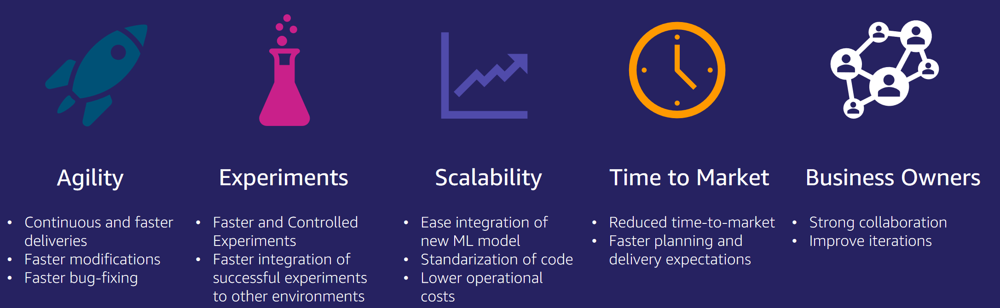
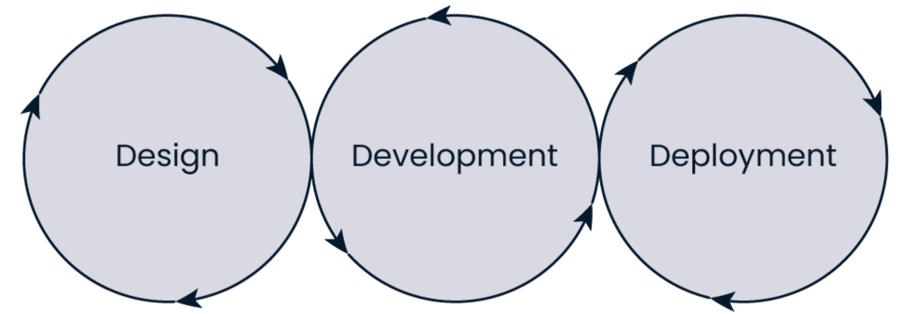
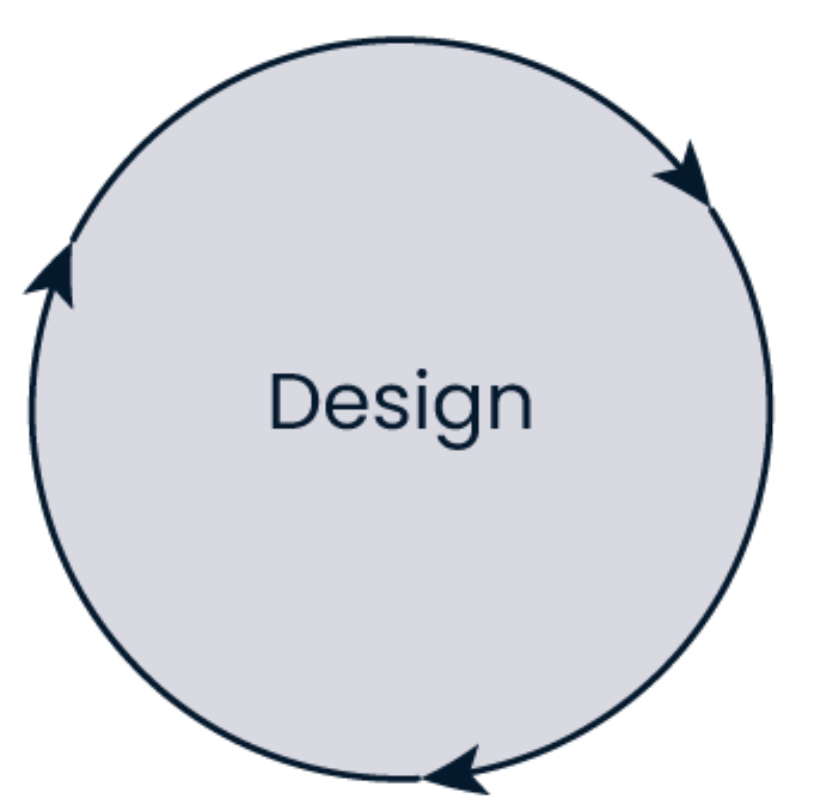
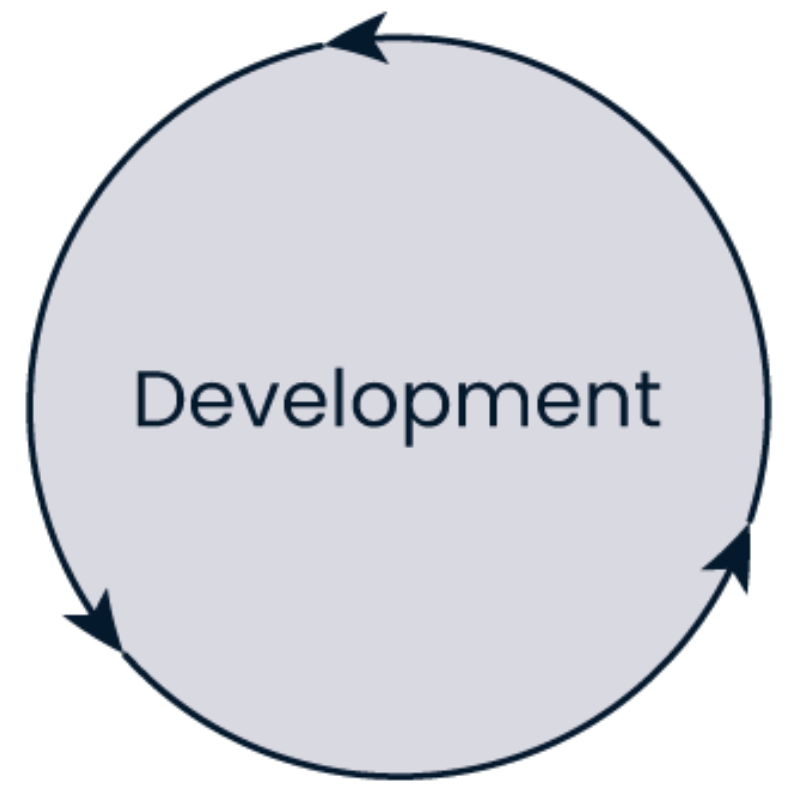
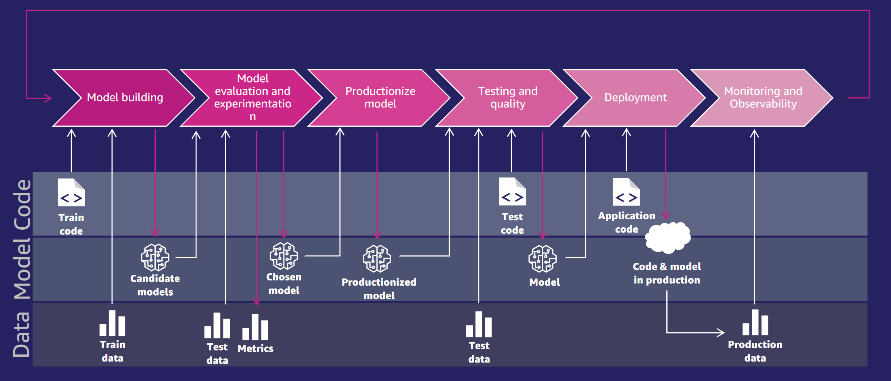
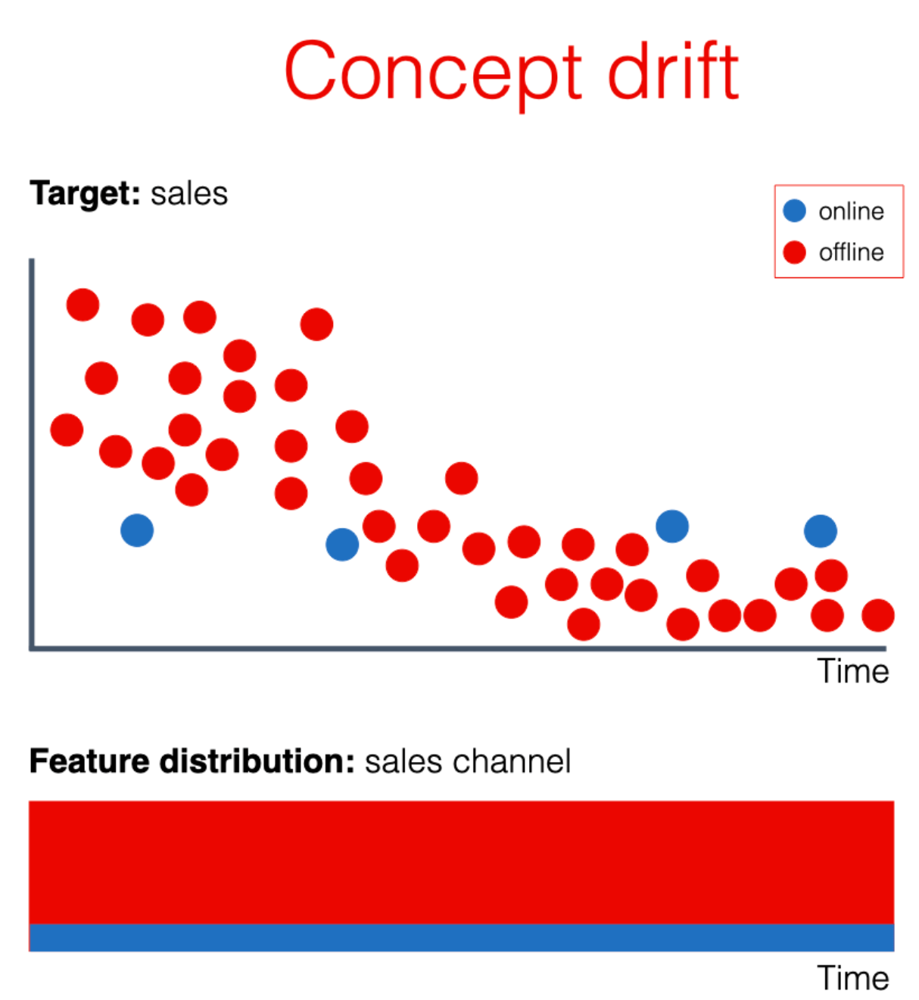
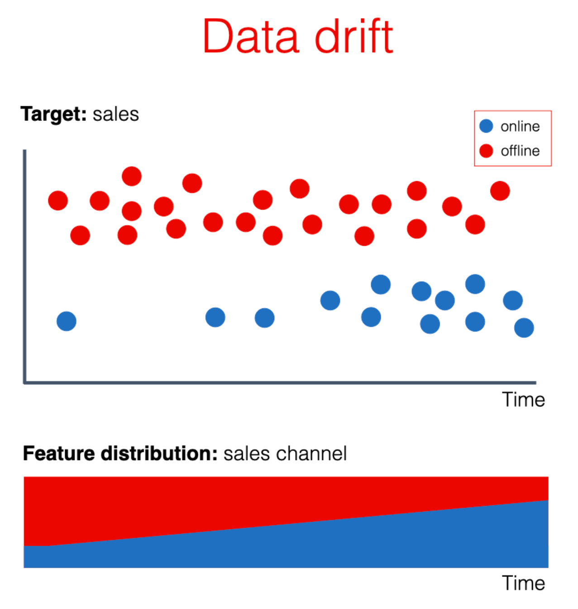
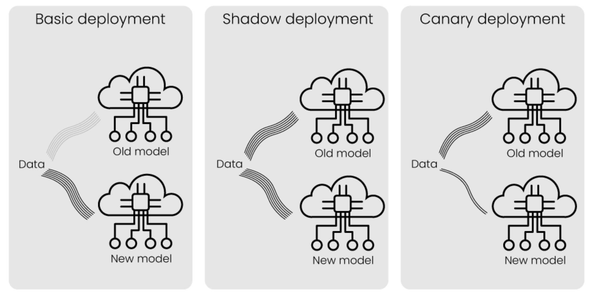

<!--
marpit
theme: gaia
class: lead
style: |
  section {
    display: flex;
    justify-content: space-between;
  }
  .left, .right {
    width: 48%;
  }
-->

<style>
    section {
        background-image: url("Ch-01/LogoUGM.jpg");
        background-repeat: no-repeat;
        background-position: right top;
        background-size:  100px;
        }
</style>
<style>
img[alt~="center"] {
  display: block;
  margin: 0 auto;
}
</style>

# Introduction to MLOps

@2024

###### [Syukron Abu Ishaq Alfarozi](#)


---


---
## What is MLOps?

**MLOps (Machine Learning Operations)** is a set of practices for designing, deploying, and maintaining machine learning in production continuously, reliably, and efficiently.

### Machine Learning Stages


---

## Why MLOps?


---

## Why MLOps?

- Better team collaboration
- Automated deployment processes
- Monitoring model performance in production environments



---
## What is MLOps?
- ML + Dev + Ops = MLOps
- Collaborative and experimental by nature  
- Automates as much as possible 
- Continuous improvement of ML models 
- Standardize and scale


---
## Stages in MLOps

- **Design**: Understanding the problem context and setting key metrics
- **Development**: ML model development, experimentation, and validation
- **Deployment and Monitoring**: Implementing the model into production systems and monitoring model performance and lifecycle improvement


---
## MLOps LifeCycle



---
## MLOps Stages: Design

- Understanding the business problem context
- Defining the added value of the ML model
- Setting business requirements
- Defining key metrics to measure



---

## MLOps Stages: Development

- Train the model with available data
- Experiment with algorithms, parameters, and model architecture
- Prepare the model for deployment



---
## MLOps Stages: Deployment and Monitoring

- Integrate the model into business systems
- Deploy the model into production
- Ensure the model's performance can be monitored


---

## Stakeholders in MLOps

**Business Roles:**

- Business stakeholders: Budget and vision decision-makers
- Subject matter experts: Deep knowledge of data and model validation

**Technical Roles:**

- Data Scientist: Data analysis, model training
- Data Engineer: Data collection, processing
- ML Engineer: Ensures the entire MLOps cycle runs smoothly

---

## Roles in the ML Lifecycle


---
## ML lifecycle management



---

# MLOps LifeCycle: Design


---

## Added Value of MLOps

- ML is **experimental and uncertain**
- Important to **estimate the expected value**
- Helps in:
  - Resource allocation
  - Setting priorities
  - Managing expectations


---

## Business Requirements

- Who are the **end users** of the model?
- How fast does the model need to run (**speed**)?
- How accurate (**accuracy**) should the model be?
- How transparent is the process (**transparency**)?
- Are there any regulations or compliance requirements (**compliance**)?
- What is the **budget** and **team size** available?


---
## Key Metrics


---

# Data Quality and Ingestion Process


---
### What is Data Quality?
  - A measure of how well data serves its intended purpose.

### Why is it important?
  - Data quality determines the quality of the ML model.
  
### Data Quality Dimensions:
1. **Accuracy**: Is the data correct?
2. **Completeness**: Is there missing data?
3. **Consistency**: Is the data synchronized across systems?
4. **Timeliness**: When is the data available?

---
## Data Ingestion


---

## Feature Engineering Techniques

- **What is Feature Engineering?**
  - The process of selecting, manipulating, and transforming raw data into **features** used by the ML model.
  
- **Goal**: Improve model performance by utilizing relevant features.

### Example Techniques:
- **Feature Selection**: Choose the most relevant features.
- **Feature Store**: Store and share features used across multiple projects.
- **Data Versioning**: Track data changes to maintain consistency.

---

## Experiment Tracking

- **Why is experiment tracking important?**
  - To **compare results** from various experiments.
  - Enables **reproducibility of experiments** in the future.
  - Collaborate with the team and report results to **stakeholders**.

  

---

### ML Experiment Process:
1. Formulate a hypothesis.
2. Collect data.
3. Define the experiment.
4. Set up experiment tracking.
5. Train the model.
6. Test the model with a test set.
7. Register the best model.
8. Visualize and report results.


---

# Monitoring in MLOps

Monitoring is a crucial component in MLOps to ensure ML models function well after deployment. Two important phenomena to monitor are **Concept Drift** and **Data Drift**.

---

## What is Concept Drift?

**Concept Drift** occurs when the relationship between features and targets in the data changes over time. This can cause previously accurate models to become less effective.



---
### Causes of Concept Drift:
- Changes in user behavior
- Market condition changes
- Policy or regulation updates

### Impact:
- Declining model accuracy
- Models become irrelevant
- Increased risk of incorrect decisions

---

## What is Data Drift?

**Data Drift** is a shift in the input data distribution used by an ML model, which can affect model performance. Even if the target remains the same, the features fed to the model change.



---
### Causes of Data Drift:
- Changes in data collection methods
- Changes in data population
- Seasonal or other external factors

### Impact:
- Models cannot capture relevant patterns
- Declining model performance in providing accurate predictions


---

## Monitoring to Address Drift

### Monitoring Techniques:
- **Descriptive Statistics**: Monitor input and output data statistics to detect changes.
- **Data Visualization**: Use charts to view data distribution and changes over time.
- **Model Performance Tracking**: Monitor model performance metrics to detect accuracy decline.

---

# Containerization in MLOps

Containerization is a method that enables applications (including machine learning models) to run in isolated and consistent environments known as **containers**.


---

## What is Containerization?

- **Containerization** is a lightweight virtualization technique that packages applications and all their dependencies into a single unit that can run consistently across different environments.
- Containers can be built and managed using tools like **Docker**.

### Advantages of Containerization:
- **Portability**: Applications can be moved between development, testing, and production environments without issues.
- **Isolation**: Reduces conflicts between different application dependencies.
- **Scalability**: Simplifies scaling applications in cloud environments.


---

## Deployment Process with Containerization

1. **Model Development**: The machine learning model is developed and trained in a local environment.
2. **Create Dockerfile**: Write a Dockerfile to define how the container image will be built.
3. **Build Image**: Use Docker to build an image from the Dockerfile.
4. **Deploy Container**: Run the container from the image in the production environment.
5. **Monitoring and Scaling**: Monitor container performance and scale as needed.

---
### Example Dockerfile:

```dockerfile
# Use base image from Python
FROM python:3.8

# Set working directory
WORKDIR /app

# Copy project files
COPY . /app

# Install dependencies
RUN pip install -r requirements.txt

# Run the application
CMD ["python", "app.py"]
```


---
# MLOps LifeCycle: CI/CD


---

## What is CI/CD?

- **CI (Continuous Integration)**: An automated process that continuously integrates code changes into the repository.
- **CD (Continuous Delivery/Deployment)**: Automation to safely and quickly deliver code changes (and ML models) to production environments.

---

## Why is CI/CD Important in MLOps?

- **Automation**: Reduces manual errors in deploying ML models.
- **Scalability**: Enables large-scale deployments quickly.
- **Reliability**: Increases team confidence in the deployed code and models.
- **Fast Iteration**: Allows quicker testing and model delivery to users.


---

## CI/CD Process in MLOps

1. **Continuous Integration (CI)**
   - Automatically validate code and models.
   - Perform linting, unit testing, and data validation.
   - Store and track model versions.

2. **Continuous Delivery (CD)**
   - Automatically deploy models to a staging environment.
   - Test model performance in an environment similar to production.

3. **Continuous Deployment**
   - Deploy models directly to production after all testing stages.
   - Monitor model performance in the production environment.

---

## CI/CD Pipeline in MLOps

### Example CI/CD Pipeline for Machine Learning:

1. **Data Collection**: The Data Engineer updates the dataset.
2. **Model Training**: The model is trained with new data.
3. **Model Validation**: The model is tested with test data to check for performance improvement.
4. **Deploy to Staging**: The model is deployed to staging for further performance testing.
5. **Deploy to Production**: After passing tests, the model is deployed to production.


---

## Tools for CI/CD in MLOps

- **GitHub Actions**: A CI/CD platform that enables automated build, testing, and deployment directly from the GitHub repository.
- **GitLab CI/CD**: An integrated platform for CI/CD pipelines.
- **Jenkins**: A popular open-source automation tool for CI/CD.
- **Kubeflow**: An MLOps platform for automating ML pipelines.
- **MLflow**: A tool for experiment tracking, model storage, and deployment.


---

## Challenges in Implementing CI/CD in MLOps

- **Data Management**: Maintaining data consistency and quality during development.
- **Model Automation**: Building pipelines that can handle model experimentation with various hyperparameters.
- **Model Testing**: Different from regular application testing as it involves prediction performance.
- **Scalability**: Managing pipelines for multiple projects with large datasets.

---
## Deployment Strategies


---
## MLOps Maturity


---

## References
1. https://hktw-resources.awscloud.com/webinar-slides/introduction-to-mlops
2. https://cloud.google.com/architecture/mlops-continuous-delivery-and-automation-pipelines-in-machine-learning
3. https://www.datacamp.com/courses/mlops-concepts

