<!--
marpit
theme: gaia
class: lead
style: |
  section {
    display: flex;
    justify-content: space-between;
  }
  .left, .right {
    width: 48%;
  }
-->

<style>
    section {
        background-image: url("Ch-01/LogoUGM.jpg");
        background-repeat: no-repeat;
        background-position: right top;
        background-size:  100px;
        }
</style>
<style>
img[alt~="center"] {
  display: block;
  margin: 0 auto;
}
</style>

# Pengantar MLOps

@2024

###### [Syukron Abu Ishaq Alfarozi](#)


---

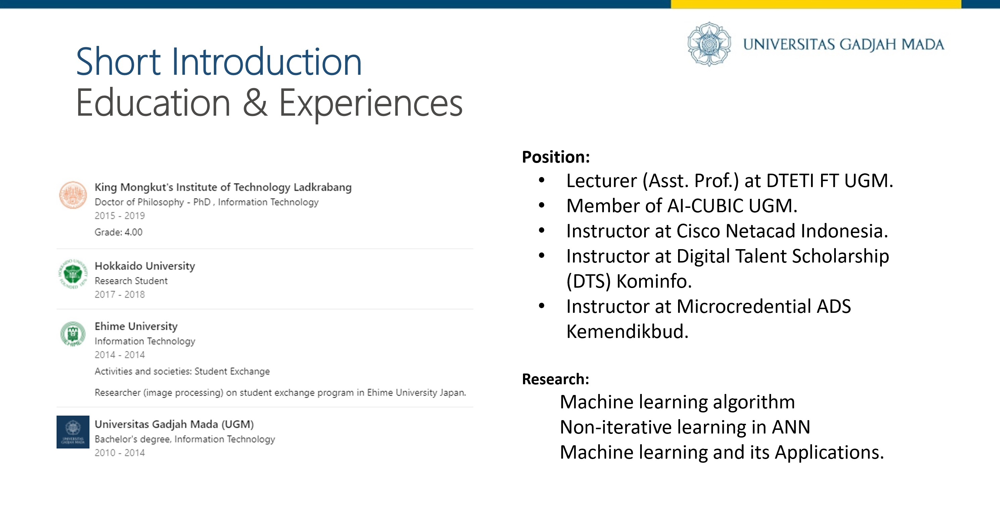

---
## Apa itu MLOps?

**MLOps (Machine Learning Operations)** adalah serangkaian praktik untuk merancang, menerapkan, dan memelihara pembelajaran mesin dalam produksi secara terus menerus, andal, dan efisien.

### Tahapan Pembelajaran Mesin

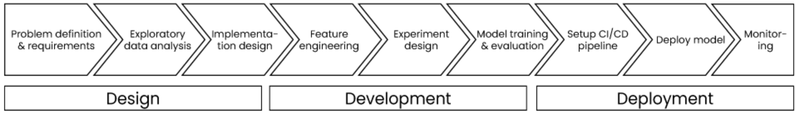

---

## Mengapa MLOps?


---

## Mengapa MLOps?

- Kolaborasi yang lebih baik antar tim
- Otomatisasi proses deployment
- Monitoring performa model di lingkungan produksi

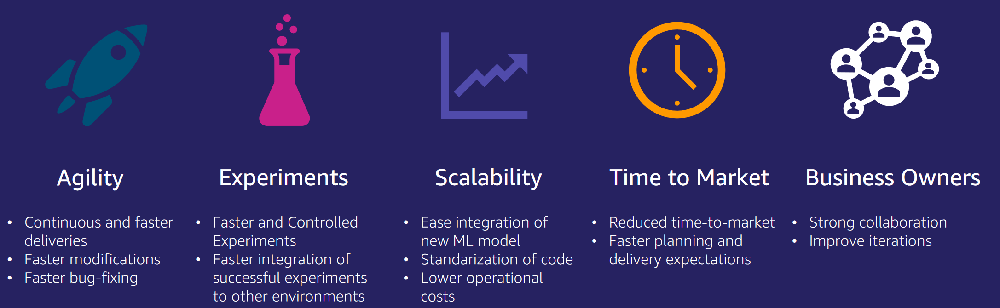

---
## Apa itu MLOps
- ML + Dev + Ops = MLOps
- Kolaboratif dan eksperimental dalam sifatnya  
- Mengotomatisasi sebanyak mungkin 
- Perbaikan berkelanjutan dari Model ML 
- Standarisasi dan Skalakan

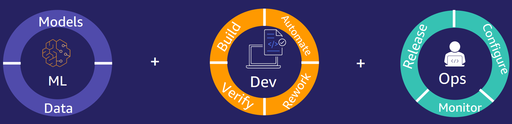

---
## Tahapan dalam MLOps

- **Perancangan**: Memahami konteks masalah dan menetapkan metrik utama
- **Pengembangan**: Pengembangan model ML, eksperimen, dan validasi
- **Penerapan dan Monitoring**: Implementasi model dalam sistem produksi serta pemantauan performa model dan siklus perbaikan


---
## MLOps LifeCycle

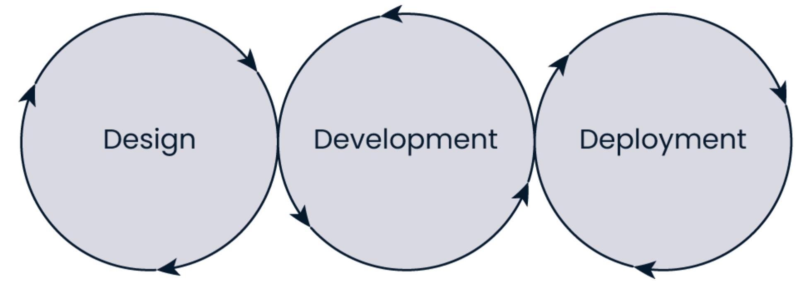

---
## Tahapan MLOps: Perancangan

- Memahami konteks masalah bisnis
- Menetapkan nilai tambah dari model ML
- Menentukan persyaratan bisnis
- Menetapkan metrik kunci yang perlu diukur

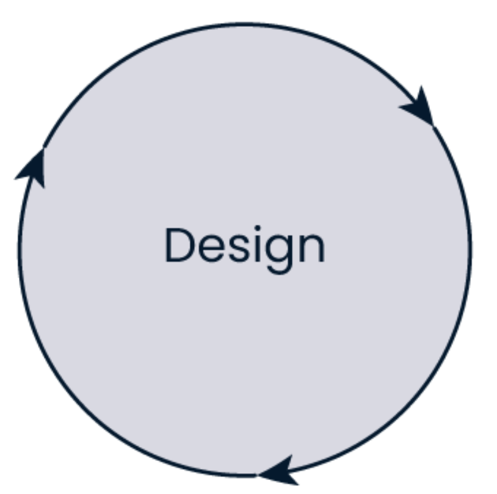

---

## Tahapan MLOps: Pengembangan

- Melatih model dengan data yang tersedia
- Eksperimen dengan algoritma, parameter, dan arsitektur model
- Menyiapkan model yang siap untuk di-deploy

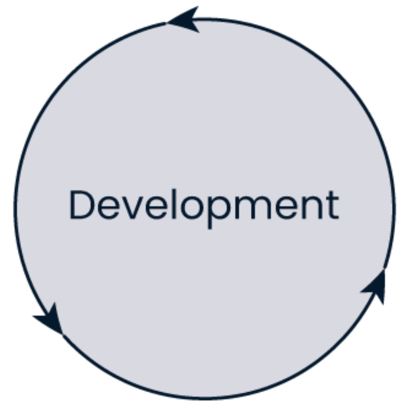

---
## Tahapan MLOps: Penerapan dan Monitoring

- Mengintegrasikan model ke dalam sistem bisnis
- Men-deploy model ke lingkungan produksi
- Memastikan performa model dapat dipantau

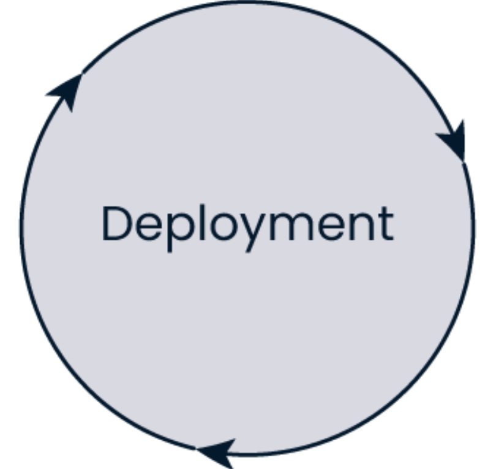

---

## Pemangku Kepentingan dalam MLOps

**Peran Bisnis:**

- Pemangku kepentingan bisnis: Penentu anggaran dan visi
- Pakar domain (*subject matter expert*): Pengetahuan mendalam tentang data dan validasi model

**Peran Teknis:**

- Data Scientist: Analisis data, pelatihan model
- Data Engineer: Pengumpulan, pemrosesan data
- ML Engineer: Memastikan seluruh siklus MLOps berjalan lancar

---

## Peran dalam ML Lifecycle

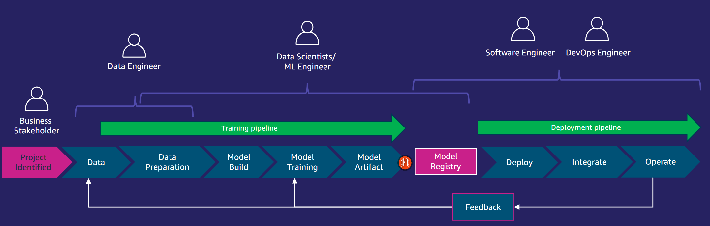

---
## ML lifecycle management

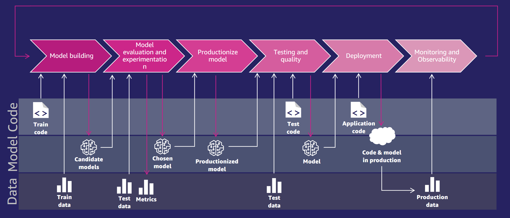

---

# MLOps LifeCycle: Perancangan

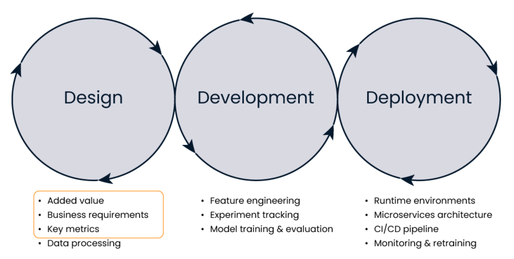

---

## Nilai Tambah dari MLOps

- ML adalah **eksperimental dan tidak pasti**
- Penting untuk **memperkirakan nilai yang diharapkan**
- Membantu dalam:
  - Alokasi sumber daya
  - Penentuan prioritas
  - Pengaturan ekspektasi

 <!-- Image Placeholder -->

---

## Persyaratan Bisnis

- Siapa **pengguna akhir** dari model ini?
- Seberapa cepat model harus berjalan (**kecepatan**)?
- Seberapa akurat (**akurasi**) hasil model?
- Seberapa transparan prosesnya (**transparansi**)?
- Apakah ada regulasi atau kepatuhan (**compliance**) yang harus dipatuhi?
- Apa **anggaran** dan **ukuran tim** yang tersedia?

 <!-- Image Placeholder -->

---
## Metrik Kunci

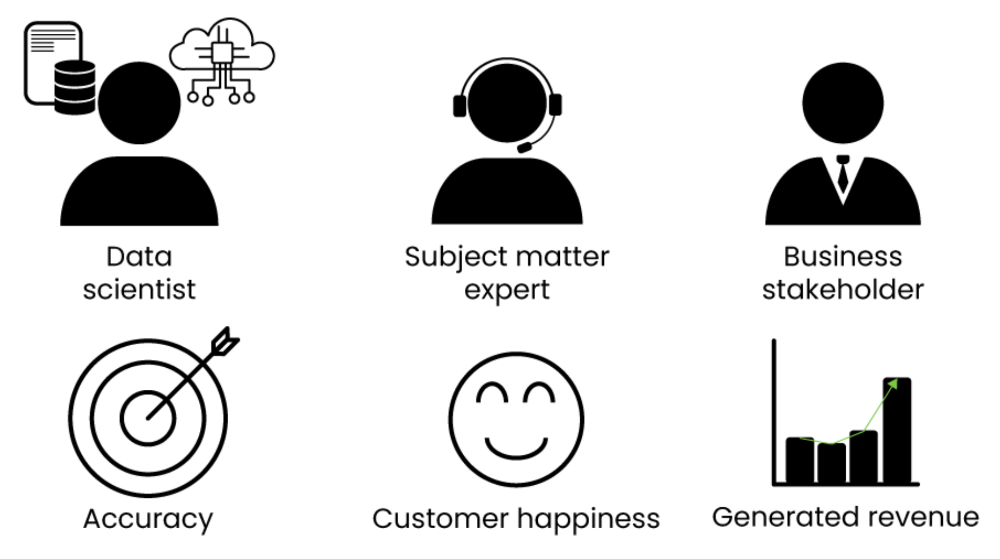

---

# Kualitas Data dan Proses Ingesti

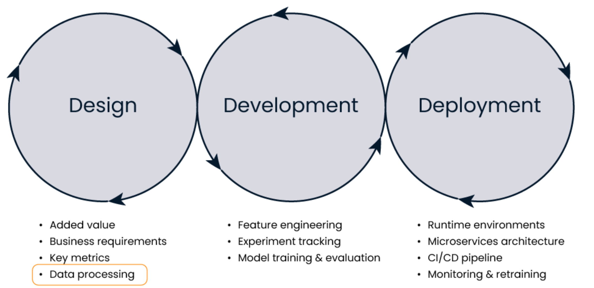

---
### Apa itu kualitas data?
  - Ukuran seberapa baik data melayani tujuan yang dimaksudkan.

### Mengapa penting?
  - Kualitas data menentukan kualitas model ML.
  
### Dimensi Kualitas Data:
1. **Akurasi**: Apakah data benar?
2. **Kelengkapan**: Apakah ada data yang hilang?
3. **Konsistensi**: Apakah data sinkron di seluruh sistem?
4. **Ketepatan waktu**: Kapan data tersedia?

---
## Data Ingesti


---

## Teknik Feature Engineering

- **Apa itu Feature Engineering?**
  - Proses memilih, memanipulasi, dan mengubah data mentah menjadi **fitur** yang digunakan oleh model ML.
  
- **Tujuan**: Meningkatkan performa model dengan memanfaatkan fitur yang relevan.

### Contoh Teknik:
- **Seleksi Fitur**: Memilih fitur yang paling relevan.
- **Feature Store**: Menyimpan dan berbagi fitur yang digunakan di berbagai proyek.
- **Kontrol Versi Data**: Melacak perubahan data untuk menjaga konsistensi.

---

## Pelacakan Eksperimen

- **Mengapa pelacakan eksperimen penting?**
  - Untuk **membandingkan hasil** dari berbagai eksperimen.
  - Memungkinkan **reproduksi eksperimen** di masa depan.
  - Berkolaborasi dengan tim dan melaporkan hasil kepada **pemangku kepentingan**.

  

---

### Proses Eksperimen ML:
1. Merumuskan hipotesis.
2. Mengumpulkan data.
3. Mendefinisikan eksperimen.
4. Menyiapkan pelacakan eksperimen.
5. Melatih model.
6. Menguji model dengan test set.
7. Mendaftarkan model terbaik.
8. Visualisasi dan pelaporan hasil.


---

# Monitoring dalam MLOps

Monitoring adalah komponen krusial dalam MLOps untuk memastikan model ML berfungsi dengan baik setelah deployment. Dua fenomena penting yang perlu diperhatikan adalah **Concept Drift** dan **Data Drift**.

---

## Apa itu Concept Drift?

**Concept Drift** terjadi ketika hubungan antara fitur dan target dalam data berubah seiring waktu. Ini dapat menyebabkan model yang sebelumnya akurat menjadi kurang efektif.

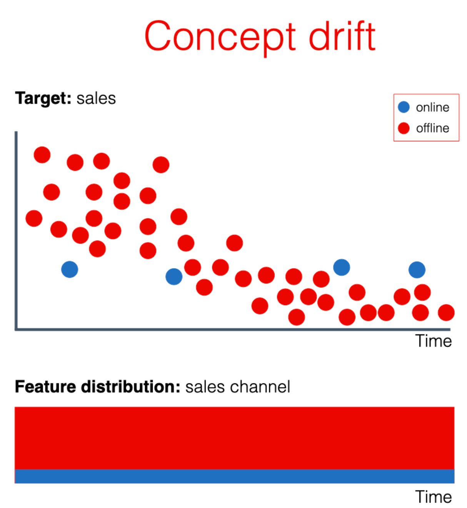

---
### Penyebab Concept Drift:
- Perubahan dalam perilaku pengguna
- Perubahan kondisi pasar
- Pembaruan kebijakan atau regulasi

### Dampak:
- Penurunan akurasi model
- Model menjadi tidak relevan
- Meningkatkan risiko keputusan yang salah

---

## Apa itu Data Drift?

**Data Drift** adalah perubahan dalam distribusi data input yang digunakan oleh model ML, yang dapat mempengaruhi performa model. Meskipun target tetap sama, fitur yang diumpankan ke model berubah.

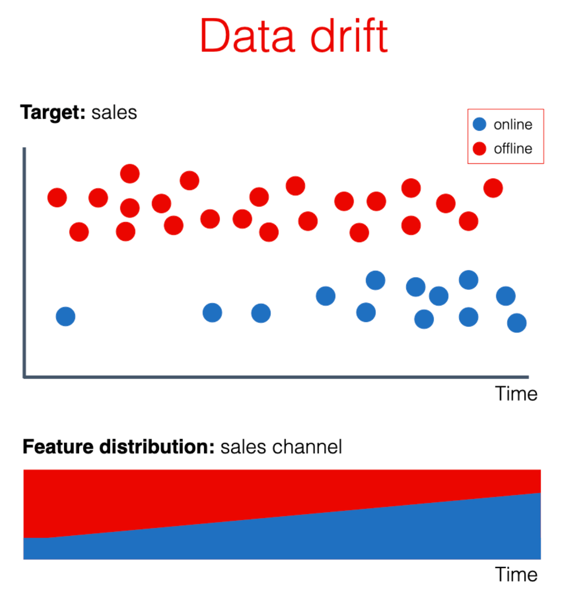

---
### Penyebab Data Drift:
- Perubahan cara data dikumpulkan
- Perubahan dalam populasi data
- Musim atau faktor eksternal lainnya

### Dampak:
- Model tidak dapat menangkap pola yang relevan
- Penurunan performa model dalam memberikan prediksi yang akurat


---

## Monitoring untuk Mengatasi Drift

### Teknik Monitoring:
- **Statistik Deskriptif**: Memantau statistik data input dan output untuk mendeteksi perubahan.
- **Visualisasi Data**: Menggunakan grafik untuk melihat distribusi data dan perubahan seiring waktu.
- **Model Performance Tracking**: Memantau metrik performa model untuk mendeteksi penurunan akurasi.

---

# Containerization dalam MLOps

Containerization adalah metode yang memungkinkan aplikasi (termasuk model machine learning) untuk dijalankan dalam lingkungan yang terisolasi dan konsisten, yang dikenal sebagai **container**.


---

## Apa itu Containerization?

- **Containerization** adalah teknik virtualisasi ringan yang membungkus aplikasi dan semua dependensinya ke dalam satu unit yang dapat dijalankan secara konsisten di berbagai lingkungan.
- Container dapat dibangun dan dikelola menggunakan alat seperti **Docker**.

### Keuntungan Containerization:
- **Portabilitas**: Aplikasi dapat dipindahkan antara lingkungan pengembangan, pengujian, dan produksi tanpa masalah.
- **Isolasi**: Mengurangi konflik antara dependensi aplikasi yang berbeda.
- **Skalabilitas**: Memudahkan pengelolaan skala aplikasi dalam lingkungan cloud.


---

## Proses Deployment dengan Containerization

1. **Pengembangan Model**: Model machine learning dikembangkan dan dilatih di lingkungan lokal.
2. **Membuat Dockerfile**: Menulis Dockerfile untuk mendefinisikan bagaimana image container akan dibangun.
3. **Build Image**: Menggunakan Docker untuk membuat image dari Dockerfile.
4. **Deploy Container**: Menjalankan container dari image di lingkungan produksi.
5. **Monitoring dan Scaling**: Memantau performa container dan menskalakan sesuai kebutuhan.
---
### Contoh Dockerfile:

```dockerfile
# Gunakan base image dari Python
FROM python:3.8

# Set direktori kerja
WORKDIR /app

# Salin file requirements
COPY requirements.txt .

# Install dependensi
RUN pip install -r requirements.txt

# Salin sisa kode aplikasi
COPY . .

# Jalankan aplikasi
CMD ["python", "app.py"]
```

---
# MLOps LifeCycle: CI/CD


---

## Apa itu CI/CD?

- **CI (Continuous Integration)**: Proses otomatis yang mengintegrasikan perubahan kode secara terus menerus ke dalam repository.
- **CD (Continuous Delivery/Deployment)**: Otomatisasi untuk mengirim perubahan kode (dan model ML) ke lingkungan produksi dengan aman dan cepat.

---

## Mengapa CI/CD Penting dalam MLOps?

- **Otomatisasi**: Mengurangi kesalahan manual dalam deploy model ML.
- **Skalabilitas**: Memungkinkan deployment skala besar dengan cepat.
- **Keandalan**: Meningkatkan kepercayaan tim terhadap kode dan model yang dideploy.
- **Iterasi Cepat**: Memungkinkan pengujian dan pengiriman model lebih cepat ke pengguna.


---

## Proses CI/CD dalam MLOps

1. **Continuous Integration (CI)**
   - Validasi kode dan model secara otomatis.
   - Melakukan linting, testing unit, dan validasi data.
   - Menyimpan dan melacak versi model.

2. **Continuous Delivery (CD)**
   - Deploy model secara otomatis ke staging environment.
   - Pengujian performa model di environment yang mirip dengan produksi.

3. **Continuous Deployment**
   - Deployment model langsung ke produksi setelah semua tahap pengujian.
   - Pemantauan performa model di lingkungan produksi.

---

## Pipeline CI/CD dalam MLOps

### Contoh Pipeline CI/CD untuk Machine Learning:

1. **Pengumpulan Data**: Data Engineer mengupdate dataset.
2. **Training Model**: Model dilatih dengan data baru.
3. **Validasi Model**: Model diuji dengan data test dan dilihat apakah performa meningkat.
4. **Deploy ke Staging**: Model dideploy ke staging untuk pengujian performa lebih lanjut.
5. **Deploy ke Produksi**: Setelah lulus uji, model dideploy ke produksi.


---

## Tools untuk CI/CD dalam MLOps

- **GitHub Actions**: Platform CI/CD yang memungkinkan otomatisasi build, test, dan deployment langsung dari repositori GitHub.
- **GitLab CI/CD**: Platform terintegrasi untuk CI/CD pipeline.
- **Jenkins**: Otomatisasi open-source yang populer untuk CI/CD.
- **Kubeflow**: Platform MLOps untuk otomatisasi pipeline ML.
- **MLflow**: Alat pelacakan eksperimen, penyimpanan model, dan deployment.


---

## Tantangan dalam Implementasi CI/CD di MLOps

- **Pengelolaan Data**: Menjaga konsistensi dan kualitas data selama pengembangan.
- **Otomatisasi Model**: Membuat pipeline yang dapat menangani eksperimen model dengan berbagai hyperparameter.
- **Pengujian Model**: Berbeda dengan pengujian aplikasi biasa karena melibatkan performa prediksi.
- **Skalabilitas**: Mengelola pipeline untuk berbagai proyek dengan dataset besar.

---
## Strategi Deployment
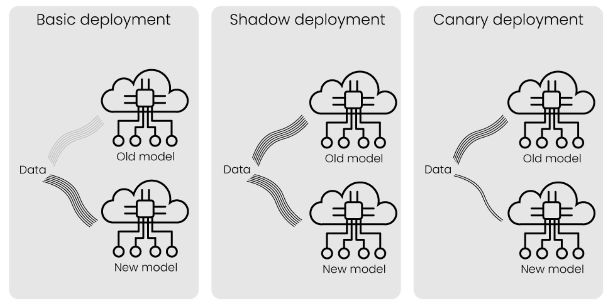

---
## MLOps Maturity

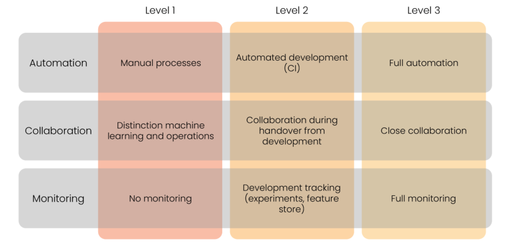

---

## Referensi
1. https://hktw-resources.awscloud.com/webinar-slides/introduction-to-mlops
2. https://cloud.google.com/architecture/mlops-continuous-delivery-and-automation-pipelines-in-machine-learning
3. https://www.datacamp.com/courses/mlops-concepts
